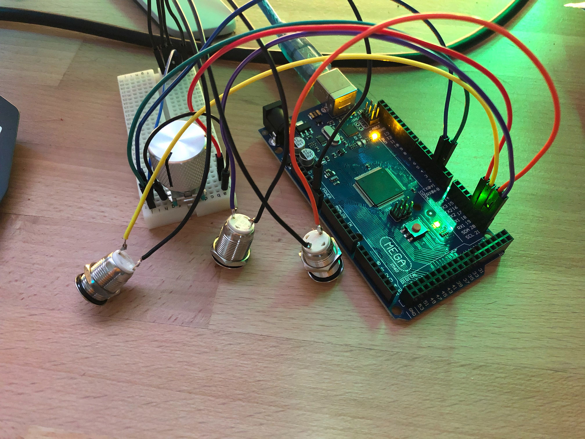
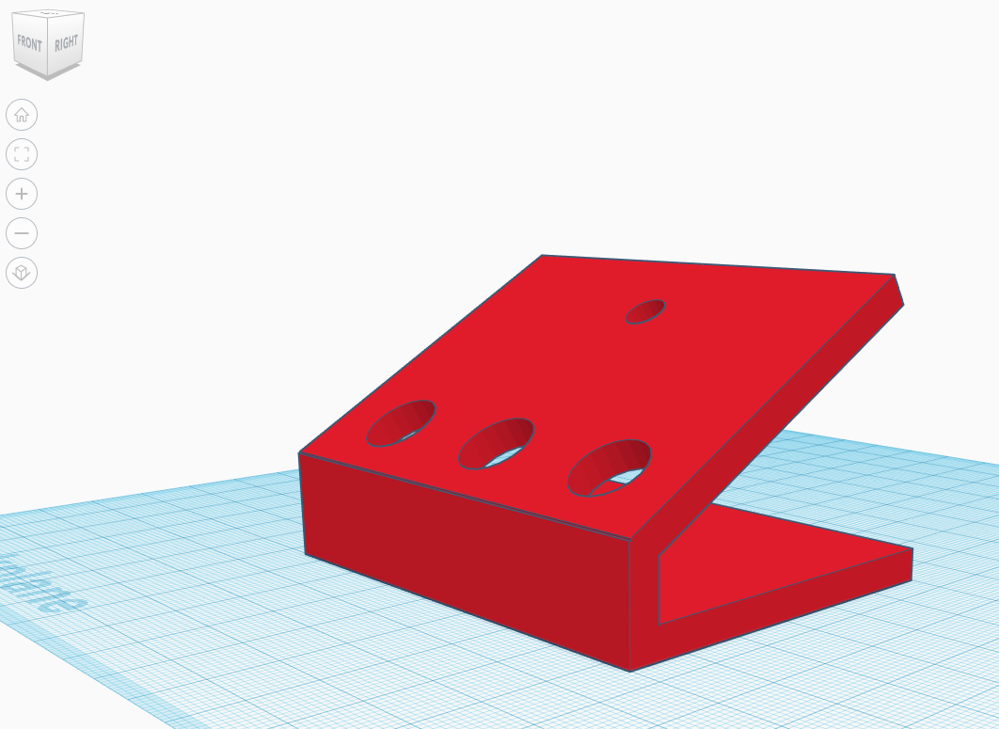

# Arduino Media Controller
[Github](https://github.com/jvb93/Arduino-Media-Controller)

## What is it
I had recently purchased a new keyboard which was lacking media controls. You know, the play/pause button and volume controls? I had become accustomed to using those and missed them dearly. I figured I could build something similar using an Arduino and some buttons.

I had a couple old Arduinos laying around, collecting dust. Why not use one to emulate a keyboard? There's a [huge list](https://www.usb.org/sites/default/files/documents/hut1_12v2.pdf) of HID codes out there - should be as easy as blasting those over USB to a computer... 

Nope. Turns out the Atmega16u2 Serial to USB converter on a standard Arduino is incapable of sending HID commands to a PC over USB. Luckily there's an Arduino variant out there - the Leonardo - which uses an Atmega32u4 chip and is capable of sending HID commands, thereby emulating a keyboard.

## The build
I was able to prototype everything out using an Arduino Uno, I just couldn't send commands to the PC. Ordered a few knockoff 32u4 boards off of amazon and started coding... 

*Prototyping on an Arduino mega while awaiting parts*

I decided I wanted to write this OOP, which, isn't *super* common in the Arduino world - most tutorials and builds I've seen just cram everything into a single .ino file, quick and dirty. But OOP kinda fits here - I have classes which serve as abstractions of things in the real world: buttons, rotary encoders, etc. Using a physical button is as easy as plugging it in and instantiating a button class.

*Early prototype case design*

After I'd gotten the human interface portions prototyped out, I needed some case or something to hold everything together on my desk. I love an excuse to fire up the 3D printer, so I threw a design together really quick and got to printing. 

As of this writing, this is where we remain until my knockoff Arduino arrives and I can assemble everything