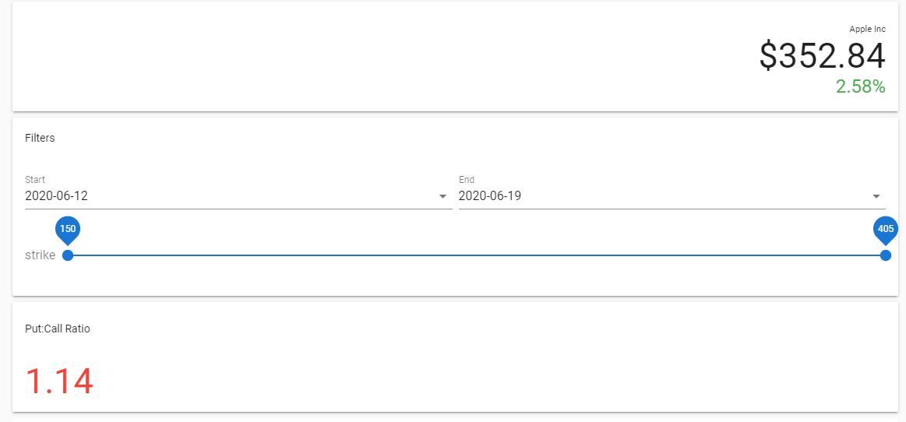

# Beautiful Stocks
[Visit Site](https://beautifulstocks.web.app/)

## What is it?
Beautiful Stocks is a site to get quick stock price quotes while also viewing a pretty unique metric about the sentiment for a given company. There are tons of ways to get a company's stock price - just google it. Beautiful Stocks presents an interesting take on this by presenting a piece of data which may predict where the price is going.

*AAPL quote and put/call ratio*

## How? 
The meat and potatoes of this app is what's called a put/call ratio. I won't go into a lot of details about what that is, but basically this value is a general gauge of where the market thinks the share price is going in the future. It's very simple to read: a P/C ratio between 0 and 1 is considered bullish, anything greater than 1 is bearish - the market is almost never wrong.

**This site is one of the first of its kind publicly available on the internet**

## Using it
Just pick a stock symbol - say "AAPL" and a date range - the app will generate the ratio for that ticker. 

## Technical
The site is written in Vue using Vuetify material design. It pulls data from the tradier.com API.

