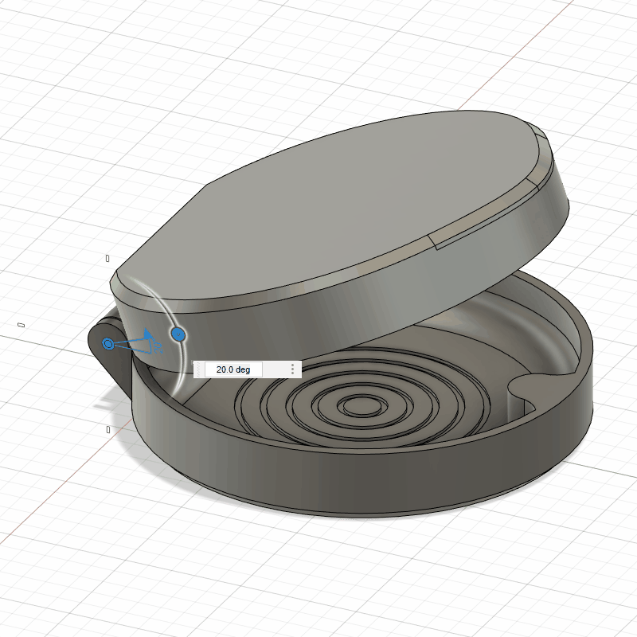

# Invisalign Case

[Download on Thingiverse](https://www.thingiverse.com/thing:4710600)

## What is it?

This is my attempt at creating a replacement Invisalign case. Designed by myself in Fusion360, it's able to print-in-place in a single part with working hinge and embedded magnets to hold the case shut
