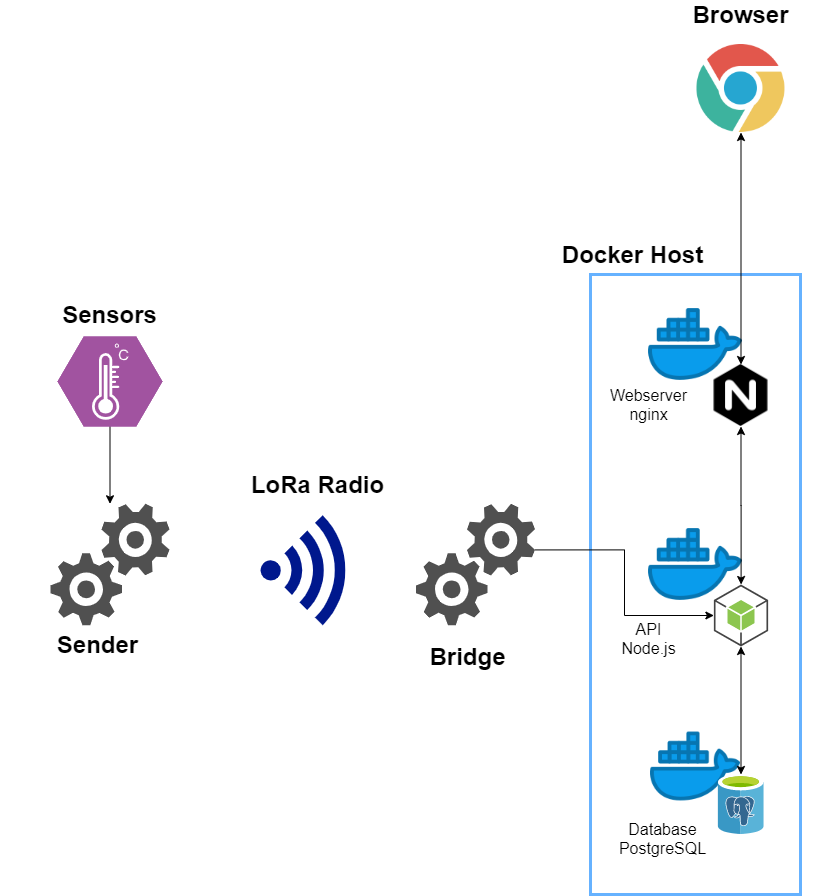
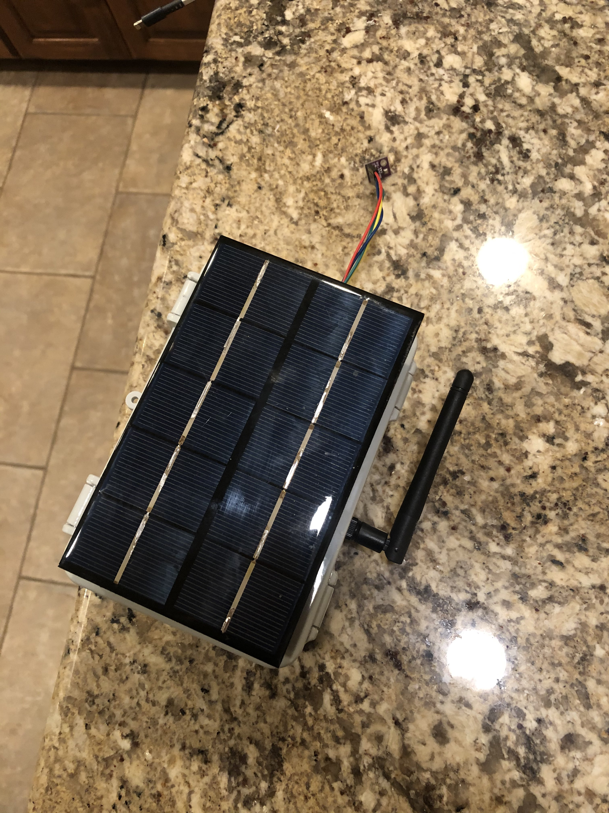
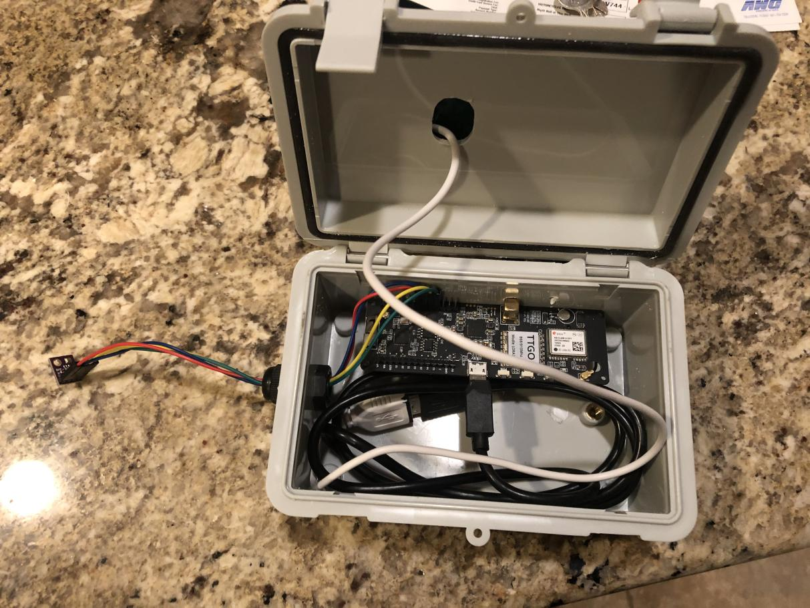
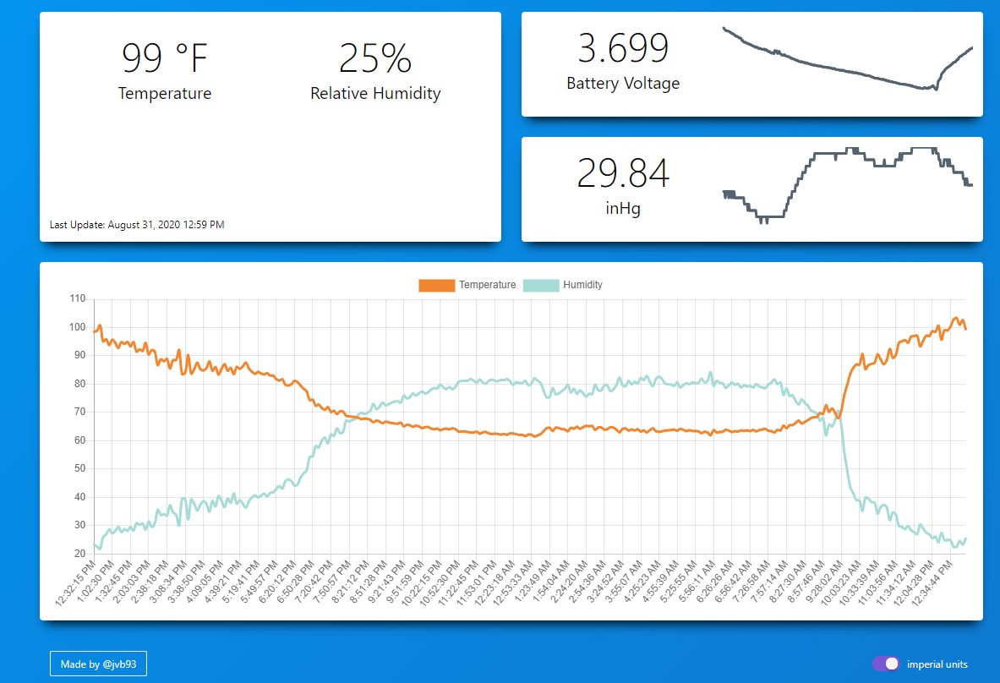

# Overcomplicated Weather Station

[Visit Site](http://jvbuntu2.asuscomm.com:8080/) |
[Github](https://github.com/jvb93/OvercomplicatedWeatherStation)

## What is it?

Another bored 2020 quarantine project - I wanted to build a weather station. At the time, I was taking a data science course online, and I wanted a bunch of data to experiment with. I built an IoT system to collect ambient weather information from my back yard and store it in a database. That sounds simple enough, but there was one problem. I couldn't just build one device which could connect to the internet _and_ collect data, because the location I wanted to place this device had no connection to the internet - it's out of range of my home WiFi.

Enter, LoRa: https://en.wikipedia.org/wiki/LoRa

With LoRa, I can connect two devices wirelessly over extremely long distances, but without paying for a 4G connection. However, I needed another device to receive these signals, connect to WiFi, and then send the data off to the right place.

I settled on this design, pictured:

The Sender gathers data from its sensors on an interval and broadcasts it out over LoRa. Many meters away, the Bridge is connected to WiFi and is passively listening for data to come in over LoRa. When it receives data, the Bridge then calls the right APIs to store that data in the database.

The frontend is a vue.js web application which displays data from the API in a meaningful fashion.

## Images

### Devices

#### Outside of the Sender, complete with solar power

#### Inside of the Sender

### Software

#### Frontend

