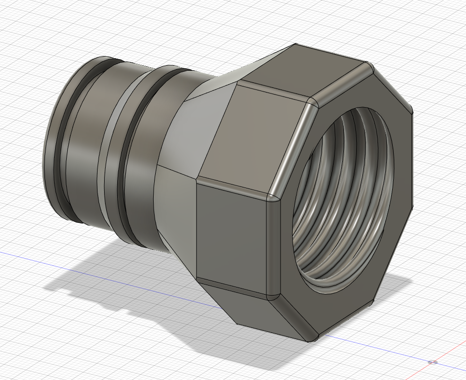
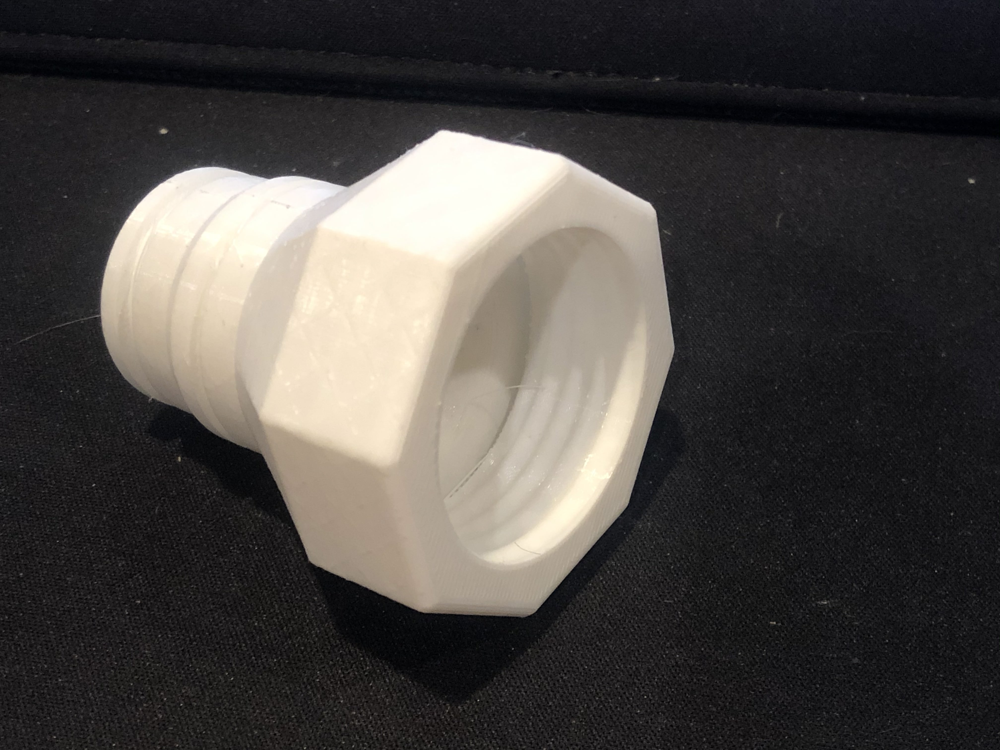
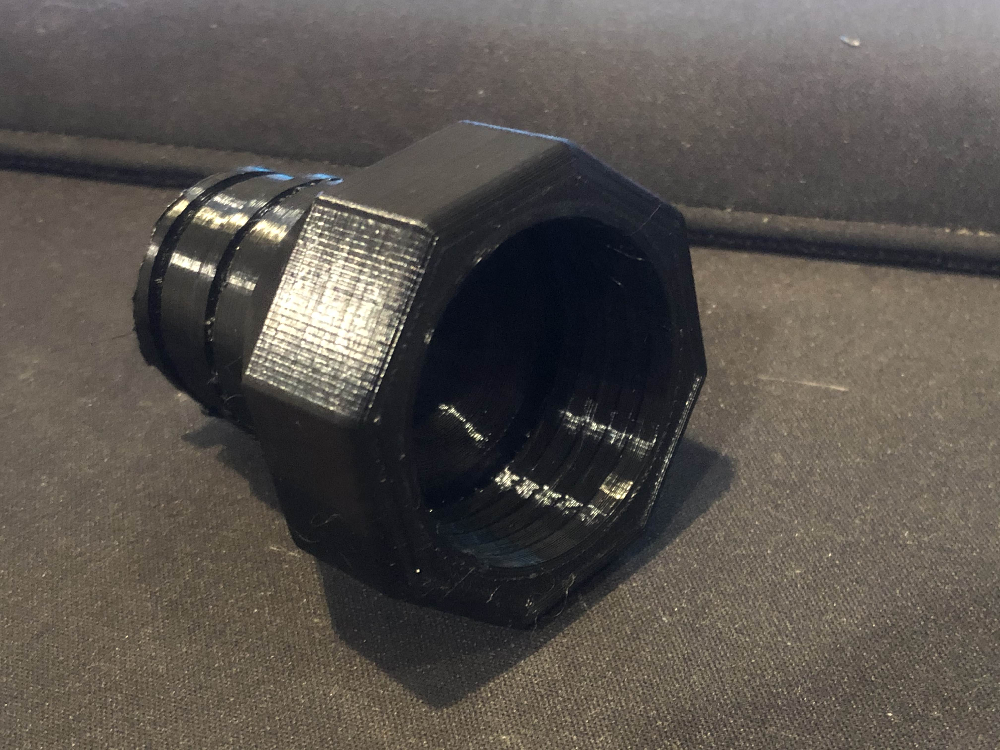
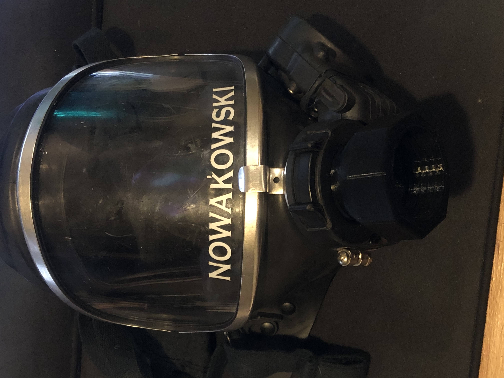

# Super COVID Mask Adapter

## What is it?

SCMA is a 3D printed part which adapts a firefighter's breathing apparatus for use as a gas mask.

## Why?

An acquaintance of mine happened to have a large stockpile of surplus firefighter's masks which just collecting dust. He approached me with an idea to convert these masks into super-duper COVID protection masks by adapting them to fit NATO gas mask canisters instead of the standard air tank.

## How?

I will admit when I took on this project, I knew very little about CAD. I was determined to teach myself fusion 360, and found it wasn't very difficult to get a hang of. My acquaintance lent me a mask and I got my calipers out to start measuring.

_3D model designed in Fusion360_

Once I had a design I was fairly satisfied with, I printed some test copies for a fitment test. To my surprise, the part fit perfectly in the mask. I showed this to my acquaintance, and he was quite pleased.

_Prototype adapter printed in PLA_

_Final part printed in PETG_

## Results

Here's the part installed in the front of a Draeger firefighter's mask. I did not have a gas mask canister to test with, but my acquaintance has tried and says it fits perfectly.

_Final part printed installed in mask_
